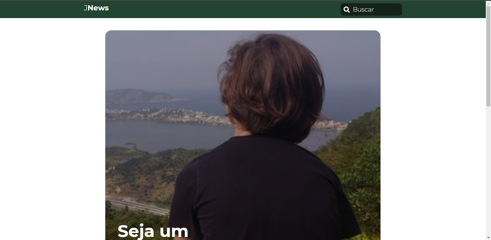
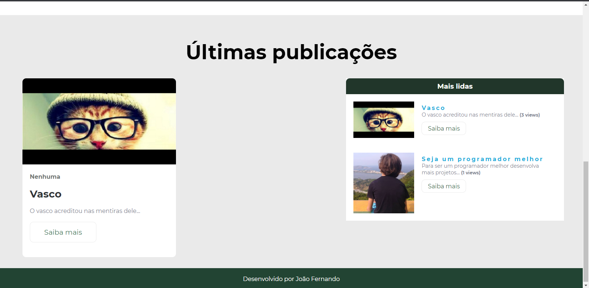
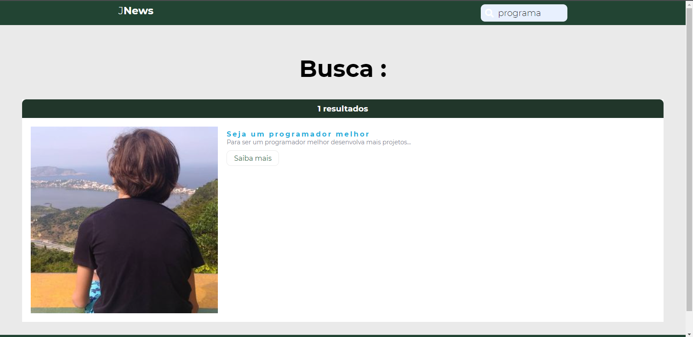
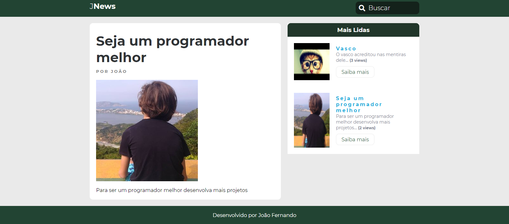
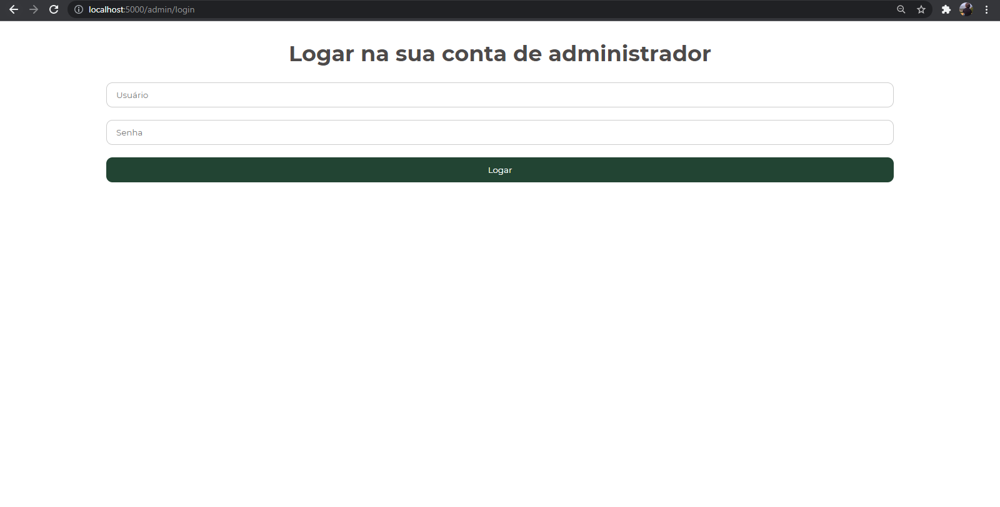
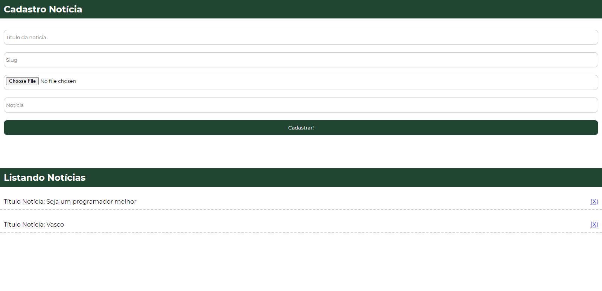

# JNews
 

 

 

Projeto desenvolvido com a danki code e alterado para coisas do meu gosto, como a estilização, a paleta de cores, o login de usuário, a estilização dos inputs, entre outras coisas. 

Esse projeto foi desenvolvido usando as seguites ferramentas:
  - Node.js
  - HTML
  - Express
  - MongoDB Atlas
  - Mongoose
  - BodyParser
  - CSS
  - JavaScript

O objetivo deste projeto foi evoluir minhas habilidades com Node.js e com rotas no express.
Também me ajudou na compreensão melhor do mongoose e da dinâmica de funcionamento do MongoDB Atlas. 

O projeto conta com:
  - Tela inicial 
  - Ranking das notícias 
  - Notícias mais recentes 
  - Busca de notícias 
  - Pagina para cada notícia de forma dinâmica 
  - Login de um painel administrador 
  - Control Panel com função de excluir e adicionar notícias

Esse foi todo o projeto espero que tenha sido proveitoso e que gostem do código, por mais que esteja sem nenhum design pattern e sem o padrão de projeto clean code
